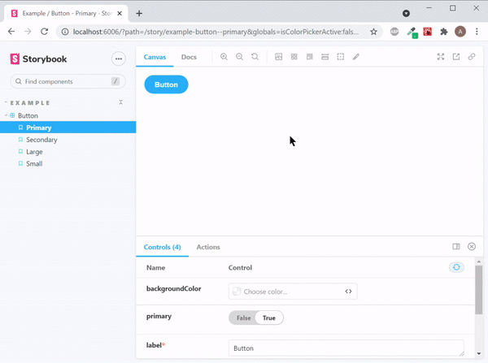

# storybook-color-picker

## Description

A Storybook addon. It allows you to quickly find and copy to clipboard any color from your custom color palette.

Add one or multiple color palettes and set the default palette globaly, for component or single story.



## Technology

Created with TypeScript, React and Storybook.

## Migrate from v1 to v2

To migrate from v1 to v2 adjust `parameters` in `preview.js` to match the pattern shown in [Usage section](#usage) below.

## Usage

`$ npm i storybook-color-picker`

### Add addon to Storybook

In your `.storybook` folder find `main.js` file and add this addon like below.

```tsx
  module.exports = {
    ...
    "addons": [
      ...
      "storybook-color-picker"
    ]
  };
```


### Add palettes

In your `.storybook` folder find `preview.js` file and add your color palette to parameters like below.
Scroll down to find out how your color [palette](#palette) must look like.

```tsx
import yourFirstColorPalette from './yourFirstColorPalette.json';
import yourSecondColorPalette from './yourSecondColorPalette.json';

export const parameters = {
  ...
  colorPalettes: {
    default: 'Your first palette name', // Name of default palette for all components and its stories. Optional (fallback to first palette from the palettes array).
    palettes: [
      {
        name: 'Your first palette name', // string
        palette: yourFirstColorPalette, // Palette as an Object or an Array. See bellow.
      },
      {
        name: 'Your second palette name',
        palette: yourSecondColorPalette,
      },
    ]
  }
};
```

## Palette

### as Object

```tsx
type ColorPaletteAsObject = Record<string, Record<string, string> | string>;
```
Example:

```tsx
  {
    "light": {
      " 500": "#aaa",
      " 100": "#eee",
      " 400": "#bbb",
      " 200": "#ddd",
      " 300": "#ccc"
    },
    "dark": {
      "0100": "#888",
      "0500": "#000",
      "0400": "#222",
      "0200": "#666",
      "0300": "#444"
    }
  }
```

`Usefull tip: add white spaces or zeros before numerical keys to prevent auto sorting`


### as Array

```tsx
  type ColorPaletteAsArray = {
    label: string,
    values: [
      {
        label: string,
        value: string, // valid hex value
      }
    ],
  };
```
Example:

```tsx
  [
    {
      "label": "light",
      "values": [
        {
          "label": "100",
          "value": "#fff"
        },
        {
          "label": "200",
          "value": "#aaa"
        }
      ]
    },
    {
      "label": "dark",
      "values": [
        {
          "label": "100",
          "value": "#222"
        },
        {
          "label": "200",
          "value": "#000000"
        }
      ]
    }
  ]
```

### Set default palette on component or its stories

#### On component

This will apply for all component's stories.

In `MyComponent.stories.js` add:

```tsx
export default {
  ...
  parameters: {
    defaultColorPalette: 'Your second palette name',
  }
};
```

#### On story

This will apply for specific story.

In `MyComponent.stories.js` add:

```tsx
export const Primary = Template.bind({});

Primary.parameters = {
  defaultColorPalette: 'Your first palette name',
}
```

#### Default palette specificity:

The following list increases by specificity.

1. `default` set on parameters in `preview.js`
2. `defaultColorPalette` set on component `parameters`
3. `defaultColorPalette` set on story `MyComponent.parameters`