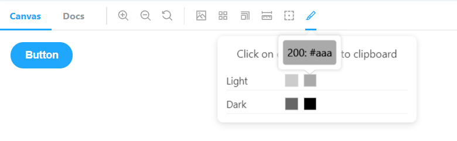

# storybook-color-picker

## Description

An addon for a Storybook that allows you to quickly find and copy to clipboard any color from your custom color palette.



## Technology

Created with TypeScript, React and Storybook.

## Usage

`$ npm i storybook-color-picker`

In your `.storybook` folder find `main.js` file and add this addon like below

```tsx
  module.exports = {
    ...
    "addons": [
      ...
      "storybook-color-picker"
    ]
  }
```


In your `.storybook` folder find `preview.js` file and add your color palette to parameters like below.
Scroll down to find out how your corol palette must look like.

```tsx
import yourFancyColorPalette from './yourFancyColorPalette.json';

export const parameters = {
  ...
  colorPalette: yourFancyColorPalette,
}
```

## Color palette

### as Object

```tsx
type ColorPaletteAsObjecy = Record<string, Record<string, string> | string>;
```
Example:

```tsx
  {
      "light": {
          " 500": "#aaa",
          " 100": "#eee",
          " 400": "#bbb",
          " 200": "#ddd",
          " 300": "#ccc"
      },
      "dark": {
          "0100": "#888",
          "0500": "#000",
          "0400": "#222",
          "0200": "#666",
          "0300": "#444"
      }
  }
```

`Usefull tip: add white spaces or zeros before numerical keys to prevent auto sorting`


### as Array

```tsx
  type ColorPaletteAsArray = {
      label: string,
      values: [
        {
          label: string,
          value: string, // valid hex value
        }
      ],
  }
```
Example:

```tsx
  [
    {
      "label": "light",
      "values": [
        {
          "label": "100",
          "value": "#fff"
        },
        {
          "label": "200",
          "value": "#aaa"
        }
      ]
    },
    {
      "label": "dark",
      "values": [
        {
          "label": "100",
          "value": "#222"
        },
        {
          "label": "200",
          "value": "#000000"
        }
      ]
    }
  ]
```